  

  

  <i><b>Olá</b> 👋, me chamo <code>João Gabriel</code>, tenho 20 anos e sou estudante de <code>Engenharia de Software</code> na <a href="https://www.pucminas.br" target="_blank">PUC Minas</a>.  
  Estudo programação desde 2023 e busco minha primeira oportunidade como desenvolvedor <code>Fullstack</code>.</i>

  

  Minhas Redes:
    
<table>
<tr>
<td>
</td>
<td>
</td>
<td>
</td>
<td>
</td>
<td>
</td>
<td>
</td>
</tr> 
</table>

Sobre mim:

<table>
<tr>
 <td align="center" colspan="2"></td>
</tr> 
<tr>
<td>

  
## 🙋‍♂️ sobremim:
me chamo joão gabriel, tenho 20 anos e sou de minas gerais. curso <a href="https://www.pucminas.br" target="_blank">engenharia de software na puc minas</a> (coração eucarístico) desde 2023. entrei na área com foco em front-end, mas logo fui me interessando também por back-end e banco de dados. desde então, estudo bastante por conta própria e estou sempre buscando aprender mais e aplicar esse conhecimento em projetos reais.

## 🎓 Estudos:
faço cursos na <a href="https://www.alura.com.br/" target="_blank">alura</a> e <a href="https://www.udemy.com/" target="_blank">udemy</a>, além das aulas da faculdade. resolvo exercícios diariamente no <a href="https://www.beecrowd.com.br/judge/pt/login" target="_blank">beecrowd</a> para treinar lógica de programação. no 4º período tive contato com arquitetura de software e padrões de projeto e isso me deu mais clareza sobre o caminho que quero seguir: ser arquiteto de software.

## 🏆 Destaque Academico:
em 26/03/2025 recebi o prêmio de destaque acadêmico pelo melhor trabalho interdisciplinar do segundo semestre de 2024. desenvolvemos um erp para uma empresa de autopeças e eu fui responsável pelo front-end, parte do back-end e criação do banco de dados. o sistema incluía:
- gerenciamento de funcionários  
- controle de estoque  
- gestão de vendas  
- gráficos com dados reais

## 📚 Rotinaestudos:
gosto de manter um ritmo de estudos constante, criando resumos dos conteúdos que vejo em aula ou nos cursos. atualmente estou lendo <a href="https://engsoftmoderna.info/" target="_blank">engenharia de software moderna</a>, do marco túlio valente, recomendado por um professor da faculdade.

## 💻 Tecnologias:
- linguagens: java, python, javascript, node.js  
- frontend: html, css, react.js  
- backend: spring boot, node.js  
- banco de dados: postgresql, sqlite, mongodb  
- ferramentas: vs code, pgadmin

## 🛠️ Projetos:
- sistema para escolha de presentes de aniversário  
- landing pages para pequenos negócios (salão, produtos de limpeza)  
- blog pessoal  
- sistema de restaurante com spring boot e postgresql (cadastro, pedidos, reservas, avaliações)

## 🌍 Idiomas:
estudo inglês com foco em uso profissional e viagens. entendo bem a leitura por conta dos jogos, e estou melhorando a escuta, fala e escrita.

## ⚽ Hobbies:
sou <a href="https://atletico.com.br/" target="_blank">atleticano</a> 🐔, apaixonado por carros 🚗 e gosto muito de jogos como:
- <a href="https://www.ea.com/pt-br/games/f1" target="_blank">f1</a>  
- <a href="https://forza.net/" target="_blank">forza horizon</a>  
- <a href="https://store.steampowered.com/app/635260/CarX_Drift_Racing_Online/" target="_blank">carx drift</a>  
- <a href="https://store.steampowered.com/app/271590/Grand_Theft_Auto_V/" target="_blank">gta v</a> (tenho várias horas na steam)

também gosto de ouvir música 🎵, ir para trilhas, correr de kart 🏎️ e praticar musculação 🏋️.

## 🎯 objetivo:
meu foco é seguir como arquiteto de software, unindo minha experiência com desenvolvimento, estruturação de sistemas e banco de dados.

## 📬 contato:
- e-mail: <a href="mailto:maiajoaogabriel.contact@gmail.com" target="_blank">maiajoaogabriel.contact@gmail.com</a>  
- linkedin: <a href="https://www.linkedin.com/in/joãogabrielmaia/" target="_blank">joãogabrielmaia</a>  
- whatsapp: <a href="https://wa.me/5531975779600" target="_blank">clique aqui para conversar</a>

</td>
<td>

</td>
</tr>
<tr>
 <td align="center" colspan="2"></td>
</tr> 
</table>

  

<!-- Seção de Ligugens e Ferramentas-->

&nbsp;Linguagens e Ferramentas:
  
<table>
<tr>
<td valign="top">

#### Linguagens

| | | |
|-|-|-|
| [   Python](https://www.python.org/) | [   Java](https://www.java.com/pt-BR/) | [   JavaFX](https://openjfx.io/) |
| [   Spring Boot](https://spring.io/) | [   HTML](https://www.w3schools.com/html/) | [   CSS](https://www.w3schools.com/css/) |
| [   JavaScript](https://www.w3schools.com/js/) | [   React.js](https://pt-br.reactjs.org/) | [   Node.js](https://nodejs.org/en/) |
</td>
<td width="50"></td>
<td valign="top">

#### Ferramentas

| | | |
|-|-|-|
| [   MySQL](https://www.mysql.com/) | [   PostgreSQL](https://www.postgresql.org/) | [   MongoDB](https://www.mongodb.com/pt-br) |
| [   Postman](https://www.postman.com/) | [   Git](https://git-scm.com/) | [   Eclipse](https://www.eclipse.org/downloads/) |
| [   NetBeans](https://netbeans.apache.org/) | [   VS Code](https://code.visualstudio.com/) | [   IntelliJ](https://www.jetbrains.com/idea/) |
</td>
</tr>
</table>

  

<!-- Seção de Projetos -->

Alguns dos meus Projetos:
  
<table>
<tr>
<td align="center" colspan="3"></td>
</tr>
<tr>
<td align="center"></td>
<td align="center"></td>
<td align="center"></td>
</tr>
<tr>
<td align="center">:movie_camera: <a href="" target="_blank">Tô de Carro</a></td>
<td align="center">:movie_camera: <a href="" target="_blank">ERP Vortex</a></td>
<td align="center">:movie_camera: <a href="" target="_blank">Restaurante Apetito</a></td>
</tr>
<tr>
<td align="center" colspan="3"></td>
</tr> 
</table>

  

<!-- Seção de Certificados -->

&nbsp; Meus Certificados:
  
<table>
<tr>
<td align="center" width="200">
<a href="https://www.pucminas.br/" target="_blank">
 
<strong>PUC Minas</strong>
</a>  
</td>
<td align="center" width="200">
<a href="https://www.udemy.com/" target="_blank">
 
<strong>Udemy</strong>
</a>  
</td>
<td align="center" width="200">
<a href="https://www.alura.com.br/" target="_blank">
 
<strong>Alura</strong>
</a>  
</td>
</tr>
</table>
  

<!-- 📊 Seção de Atividade no GitHub -->

Movimentação no GitHub:
  

<!-- Tabela com estatísticas principais -->
<table>
<tr>
<td>
<!-- Estatísticas gerais -->

</td>
<td>
<!-- Linguagens mais usadas -->

</td>
<td>
<!-- Distribuição em gráfico de pizza -->

</td>
</tr>
</table>

<!-- Links para GitHub Wrapped e WakaTime -->
<table>
<tr>
<td align="center">:octocat: <a href="https://www.githubwrapped.io/Joaogabrielmaia" target="_blank">GitHub Wrapped</a></td>
<td align="center">:watch: <a href="https://wakatime.com/@Joaogabrielmaia">WakaTime</a></td>
</tr>
<tr>
<td>
<!-- Tendências de repositórios -->

</td>
<td>
<!-- Tempo de codificação (WakaTime) -->

</td>
</tr>
</table>

<!-- Cartões adicionais do perfil -->
<table>
<td>

</td>
<td>

</td>
<td>

</td>
</tr>
<tr>
<td>

</td>
<td>

</td>
<td>

</td>
</tr>
</table>

<!-- Visitas e seguidores -->
 

  <table>
    <tr>
      <td align="center">
        
      </td>
      <td align="center">
        
      </td>
      <td align="center">
        
      </td>
    </tr>
  </table>

<!-- Seção de métricas avançadas expansível -->
 

&nbsp;Veja mais

 

<table>
<tr>
<td align="center" colspan="2">:octocat: GitHub Metrics</td>
</tr>
<tr>
<td></td>
<td></td>
</tr>
<tr>
<td></td>
<td></td>
</tr>
<tr>
<td></td>
<td></td>
</tr>
<tr>
<td></td>
<td></td>
</tr>
</table>

<!-- Seção de Leituras Atuais -->
  

&nbsp;Leituras atuais:
  

<table>
<tr>
<td align="center" width="220">
  
<strong>Engenharia de Software Moderna</strong> 
<em>Marco Túlio Valente</em>
</td>
<td align="center" width="220">
  
<strong>O Programador Pragmático</strong> 
<em>Andrew Hunt & David Thomas</em>
</td>
</tr>
</table>
 

📚 Todas as leituras acima possuem resenhas escritas por mim disponíveis no repositório acima.

  

  

Minhas músicas

<table>
<tr>
 <td align="center" colspan="3"></td>
</tr> 
<tr>
<td>

</td>
<td>

</td>
<td>

</td>
</tr>
<tr>
 <td align="center" rowspan="3"></td>
</tr> 
</table>

 

 

 
</table>

 

 

  

<table>
<td>

</td>
</tr>
</table>

